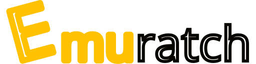

# 

[](https://github.com/hayattgd/Emuratch/actions/workflows/build.yml)
[](https://github.com/hayattgd/Emuratch/actions/workflows/build.yml)
[](https://github.com/hayattgd/Emuratch/blob/stable/LICENSE)

Scratch emulator made with C# & [raylib](https://www.raylib.com/)

Visit [nightly.link](https://nightly.link/hayattgd/Emuratch/workflows/build/dev) for latest builds.
Visit [nightly.link](https://nightly.link/hayattgd/Emuratch/workflows/build/dev) for latest builds.
Emuratch supports Windows, MacOS and Linux.

For using MacOS build, please execute command below to install gtk and libgdiplus.

```
brew install gtk+3
brew install mono-libgdiplus
```

## Controls

| Key   | Behaviour           |
|-------|---------------------|
| F1    | Load project        |
| F2    | Fix window size     |
| F3    | Show line           |
| F5    | Press flag          |
| PAUSE | Pause / resume game |
| -     | Frame advance       |

## Build

You need .NET SDK to build, and .NET Runtime to execute Emuratch.

First, clone repository from GitHub. ( only run one of them )

```bash
git clone https://github.com/hayattgd/Emuratch.git #HTTPS
git clone git@github.com:hayattgd/Emuratch.git #SSH
gh repo clone hayattgd/Emuratch #GitHub CLI
```

Move into repository directory and run `dotnet build`.

```bash
cd Emuratch
dotnet build
```

Executable file is located in `bin` subdirectory

## Contributing

Please take a look at [CONTRIBUTING.md](CONTRIBUTING.md).

## Features (To-do list)

### Blocks

- [ ] Motion
- [ ] Looks
- [ ] Sound
- [ ] Events
- [ ] Control
- [ ] Sensing
- [ ] Operators
- [ ] Variables (including List)
- [ ] My Blocks

Please reference [List](https://github.com/hayattgd/Emuratch/wiki/List-of-blocks-implemented) for more details.

### Advanced options

- [x] 60 FPS / Turbo mode (Speedhack)
- [ ] Interpolation
- [ ] High Quality Pen
- [x] Infinite Clones
- [x] Remove Fencing
- [ ] Remove Miscellaneous Limits
- [x] Custom Stage Size

### Emulation

- [ ] Interpreter
- [ ] Cached Interpreter
- [ ] JIT Compiler

### TAS

- [x] Pause / resume
- [x] Frame advance
- [ ] Savestate
- [ ] Record / Replay

### UI

- [ ] Cross-platform GUI (not text UI, but Graphical UI)
- [ ] Project list
- [ ] Advanced options
- [ ] TAS keybind

## LICENSE

This repository is distributed under [MIT License](./LICENSE).

## Used library

| Name                                                         | License                                                                                         |
|--------------------------------------------------------------|-------------------------------------------------------------------------------------------------|
| [raylib-cs](https://github.com/ChrisDill/Raylib-cs)          | [Zlib license](https://github.com/chrisdill/raylib-cs/blob/master/LICENSE)                      |
| [Newtonsoft.Json](https://www.newtonsoft.com/json)           | [MIT License](https://github.com/JamesNK/Newtonsoft.Json/blob/master/LICENSE.md)                |
| [SVG.NET](https://github.com/svg-net/SVG)                    | [Microsoft Public License](https://github.com/svg-net/SVG/blob/master/license.txt)              |
| [GtkSharp](https://github.com/GtkSharp/GtkSharp)             | [GNU LIBRARY GENERAL PUBLIC LICENSE](https://github.com/GtkSharp/GtkSharp/blob/develop/LICENSE) |
<!-- | [rlImgui-cs](https://github.com/raylib-extras/rlImGui-cs)    | [Zlib license](https://github.com/raylib-extras/rlImGui-cs/blob/main/LICENSE)                   | -->

(probably [Dependency graph](https://github.com/hayattgd/Emuratch/network/dependencies) has better view)
